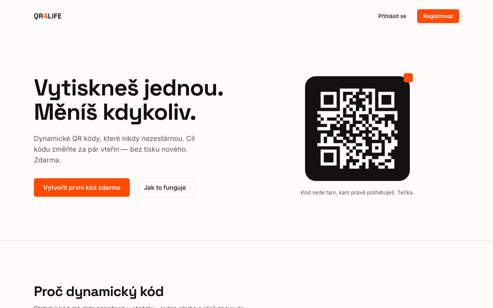

# QR4Life

Dynamic QR codes. Print once, change the destination anytime: the generated code
only contains a short URL (`https://qr.lnrtdev.cz/{hash}`), the target is managed
on the server. A static QR code cannot be changed once it is printed; here you
just edit the destination in the dashboard.

Live at [qr.lnrtdev.cz](https://qr.lnrtdev.cz).



## Features

- 7 code types: **link, Wi-Fi, vCard, phone, SMS, e-mail, plain text**
- Instant redirect (HTTP 302, `Cache-Control: no-store`), no interstitial page
- Wi-Fi codes: a page with the SSID, password, a "copy password" button and a native Wi-Fi QR
- PNG and SVG download (preview and download come from the same render)
- Scan statistics
- E-mail sign-in (argon2id, DB sessions) and Sign in with Apple
- E-mail verification, password reset, rate limiting, URL scheme whitelist,
  optional Google Safe Browsing check of destination URLs
- Admin role: block codes

## Quick start (development)

```bash
pnpm install
docker compose up -d          # local PostgreSQL on port 5433
cp .env.example .env          # fill in the values
pnpm exec prisma migrate dev  # migrations
pnpm dev
```

Without Docker: any PostgreSQL works, just set `DATABASE_URL` in `.env`.

## Tests

```bash
pnpm test                   # Vitest (unit + integration)
pnpm build                  # production build
pnpm exec playwright test   # E2E (needs a running DB)
```

## Environment variables

| Variable | Required | Description |
| --- | --- | --- |
| `DATABASE_URL` | yes | PostgreSQL connection string |
| `SESSION_SECRET` | yes | HMAC secret for the Apple sign-in state (`openssl rand -hex 32`) |
| `NEXT_PUBLIC_APP_URL` | yes | Public URL of the app (e.g. `https://qr.lnrtdev.cz`) |
| `ADMIN_EMAIL` | no | E-mail address that becomes admin on registration |
| `SMTP_HOST` / `SMTP_PORT` | no | SMTP for verification and reset e-mails (without them, links are logged to the console) |
| `SMTP_USER` / `SMTP_PASS` / `SMTP_FROM` | no | SMTP credentials |
| `APPLE_SERVICES_ID` / `APPLE_TEAM_ID` / `APPLE_KEY_ID` / `APPLE_PRIVATE_KEY` | no | Sign in with Apple (without them the button is hidden) |
| `GOOGLE_SAFE_BROWSING_KEY` | no | Destination URL check (without it only the scheme whitelist applies) |

## Deploy

The app ships as a Docker image (`Dockerfile`, Next.js standalone).
On start it runs `prisma migrate deploy` and then `node server.js`.

## License

[MIT](LICENSE)
